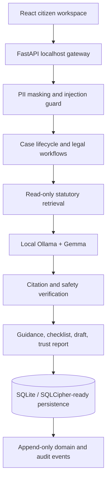

# PRAMAAN BOT — Sovereign Legal Intelligence at the Edge

> Private, offline-first legal assistance for India - from a citizen's own words to
> source-linked legal information, a reviewable action plan, and a ready-to-review document.

PRAMAAN BOT is not a cloud chatbot wrapped around a legal prompt. It is a deterministic
legal-action system designed for citizens who face three barriers at once: difficult
legal language, sensitive personal facts, and unreliable connectivity.

A citizen explains a problem in English, Hindi, or Hinglish. PRAMAAN BOT masks personal
identifiers, retrieves relevant provisions from a local statutory corpus, uses a locally
running Gemma model when available, checks section references against the local corpus, and
turns the result into a resumable procedure or fact-bound draft. The case stays on the
device.

```text
Citizen's words
      -> privacy shield
      -> legal issue detection
      -> local statutory retrieval
      -> local Gemma / deterministic fallback
      -> citation and safety verification
      -> action checklist + document draft + trust report
```

## The problem

India's legal-access gap is not only a shortage of answers.

- **Jargon excludes people.** Citizens should not need to know an Act number or legal
  phrase before they can understand their rights.
- **Legal facts are sensitive.** Complaints, identity numbers, family disputes, tenancy
  records, and evidence should not be forced through a third-party cloud model.
- **Connectivity is unequal.** A system intended for Bharat must remain useful on a
  local machine with weak or unavailable internet.
- **Chat answers disappear.** Citizens need a saved case, evidence trail, deadlines,
  procedures, drafts, and a clear next action - not another disposable conversation.

## What makes PRAMAAN BOT different

| Ordinary legal chatbot | PRAMAAN BOT |
|---|---|
| Sends prompts to a cloud model | Enforces a loopback-only model endpoint |
| Produces a one-time answer | Builds a persistent local case workspace |
| Hides reasoning quality behind confidence | Exposes citation coverage, reference checks, PII safety, and limitations |
| Treats workflow as prose | Uses deterministic, resumable procedure state |
| Overwrites mutable records | Uses CAS revisions and immutable event/audit history |
| Generic template drafting | Binds drafts to saved case facts, clearly marked for review |
| Requires dependable connectivity | Runs with local retrieval and a deterministic fallback |

## Seven-layer architecture



| Layer | Implementation | Status |
|---|---|---|
| Domain | Cases, facts, evidence, issues, laws, strategies, timelines | Implemented |
| Database | 13 legal tables, Unit of Work, CAS, tombstones, migrations | Implemented |
| Workflow | Case lifecycle, consumer/RTI/police procedures, drafting | Implemented |
| API | Typed FastAPI gateway, idempotency, evidence upload, PDF export | Implemented |
| Retrieval | Hierarchical offline statutory corpus search | MVP implemented |
| AI | Loopback-only Ollama client with configurable Gemma model | Implemented |
| UI | Responsive React case workspace and trust surfaces | Implemented |

The concept deck contains one legacy reference to an Express API. The final repository
uses FastAPI because the declared stack is Python and the domain, persistence, retrieval,
and safety services are Python-native.

## Deterministic legal infrastructure

### 1. Compare-and-swap case writes

Every mutable case write includes an expected revision:

```sql
UPDATE cases
SET status = ?, revision = revision + 1
WHERE id = ? AND revision = ? AND is_deleted = 0;
```

A stale writer receives a conflict instead of silently overwriting newer case data.

### 2. Atomic Unit of Work

Case state, legal issues, applicable laws, citations, strategies, trust reports, domain
events, and audit records are committed together. If any child write fails, the entire
transaction rolls back.

### 3. Zero physical case deletion

Deleting a case sets a tombstone, advances the revision, appends `CaseDeleted`, and writes
an immutable audit entry. Application workflows never execute `DELETE FROM cases`.

### 4. Idempotent operations

Analysis, procedure, draft, update, and deletion requests use idempotency keys. Retrying
the same operation replays its original result rather than creating duplicate state.

## Local intelligence and retrieval

PRAMAAN BOT ranks relevant Acts first and then ranks individual provisions inside those
Acts. Retrieved text and source metadata are passed to the local model as the only legal
context. If Ollama is unavailable, a constrained deterministic response is assembled
from the retrieved provisions instead of silently calling a cloud service.

The runnable default model tag is `gemma3:4b`. Set `PRAMAAN_OLLAMA_MODEL` to the exact
supported local Gemma release installed on the machine.

The model endpoint is restricted in code to `localhost`, `127.0.0.1`, or `::1`. A remote
model URL is rejected during startup.

## Citizen product surfaces

- **Dashboard** - local case register and urgency overview
- **New case** - plain-language English, Hindi, or Hinglish intake
- **Case workspace** - analysis, facts, citations, next actions, and trust score
- **Legal research** - weighted text search over the offline statutory corpus
- **Action guides** - resumable consumer, RTI, and police-complaint checklists
- **Document drafting** - fact-bound notices, complaints, and RTI applications
- **Trust report** - citation coverage, section-reference checks, PII safety, disclaimer checks, and review limitations

## Privacy and safety boundary

```text
React :5174  ->  FastAPI :8000  ->  Ollama :11434
     localhost       localhost        localhost

           SQLite + evidence + generated PDFs
                         local disk
```

- The browser never calls Ollama directly.
- The API constructs prompts and owns every case write.
- Aadhaar numbers, phone numbers, email addresses, and PAN patterns are masked before
  model processing.
- Prompt-injection patterns are blocked.
- Unsupported section references reduce the reference-check score and remain visible.
- The answer-review score weights citation coverage (40%), section checks (35%), PII
  patterns (15%), and disclaimer presence (10%), then deducts 15 points for each
  stated limitation; without an attached source it is zero. It is not a probability of legal success or proof that documents
  and legal conclusions are correct.
- Every response receives a legal-information disclaimer.
- Uploaded evidence originals are retained under the local `data/evidence/` directory and content-hashed; a hash does not establish authenticity or prove the facts asserted in a file. Previously registered metadata-only evidence cannot be downloaded.
- SQLCipher configuration fails closed if a key is supplied without a cipher-capable driver.

## Three-minute demonstration

1. On **New case**, load the landlord deposit example and create its private workspace.
2. Show that identity and contact patterns are masked locally.
3. Ask how to recover the deposit. The saved case facts are included in retrieval;
   inspect the contextual Contract Act source and the limitations behind the score.
4. Open the saved case workspace - nothing disappears after the answer.
5. Start a resumable action checklist and mark one step complete.
6. Generate a fact-bound legal notice and export it locally as PDF.
7. Disconnect Ollama and repeat a research query to demonstrate the offline deterministic fallback.

## Quick start

Prerequisites: Python 3.12+, Node.js 20+, and optionally Ollama.

In PowerShell, change to the cloned repository directory once. The commands below all
run from that same directory.

```powershell
# Run once from the repository root
powershell -NoProfile -ExecutionPolicy Bypass -File .\scripts\setup.ps1

# Terminal 1, from the repository root
.\.venv\Scripts\python.exe backend\run.py

# Terminal 2, from the repository root
Set-Location .\frontend
npm run dev
```

Wait for `Setup complete.` before starting either server. If setup reports an error,
install the missing dependency first. Do not run `Set-Location .\Pramaan-Bot_CodeCubicle`
again when your prompt already ends in `Pramaan-Bot_CodeCubicle>`.

Open `http://127.0.0.1:5174`. API documentation is available at
`http://127.0.0.1:8000/docs`.

### If npm reports `ENOTEMPTY` or Vite cannot resolve `lucide-react`

Stop the running frontend with Ctrl+C. From the repository root, rename the incomplete
dependency folder so it is recoverable, then reinstall exactly from the lockfile:

```powershell
Rename-Item -LiteralPath .\frontend\node_modules -NewName "node_modules.incomplete-$(Get-Date -Format yyyyMMdd-HHmmss)"
Set-Location .\frontend
npm ci
npm run dev
```

The renamed folder can be removed after the new install works. If the backend reports
`No module named 'uvicorn'`, rerun `setup.ps1`; it now stops on a failed Python install
instead of incorrectly reporting success.

### Enable local Gemma

```powershell
ollama pull gemma3:4b
ollama serve
$env:PRAMAAN_OLLAMA_MODEL = "gemma3:4b"
```

### Optional SQLCipher deployment

The default development driver is standard SQLite. Do not claim encrypted storage unless
a SQLCipher-capable driver is installed and a local key is configured.

```powershell
$env:PRAMAAN_DB_KEY = "load-this-from-a-local-secret-store"
```

Startup fails if a key is configured but the active driver lacks SQLCipher support.

## Tests

```powershell
.venv\Scripts\python.exe -m pytest backend -q
npm --prefix frontend run build
```

The suite covers schema integrity, atomic rollback, CAS conflicts, tombstones,
idempotency, procedures, PII masking, injection blocking, retrieval, output grounding,
storage-security reporting, and rejection of remote model endpoints.

## Repository map

```text
backend/
  app/
    database.py       schema, migration, Unit of Work, SQLCipher checks
    repositories.py   CAS, idempotency, tombstone and event policy
    services/
      legal_engine.py intent, retrieval, analysis and persistence
      rag.py          offline hierarchical statutory search
      ollama.py       loopback-only local model adapter
      shield.py       input and output safeguards
      procedures.py   resumable deterministic workflows
      drafting.py     fact-bound document generation and PDF export
    main.py           local REST gateway
  data/               demonstration corpus, procedures and court directory
  tests/              integrity and service tests
frontend/src/         connected React citizen application
packages/shieldai/    reusable model-agnostic guardrail package
docs/                 architecture and API contracts
scripts/              local setup, development and test commands
```

## Honest limitations

PRAMAAN BOT provides general legal information, not legal advice. The bundled statutory
corpus is a compact demonstration set, not a production legal database. Before real-world
deployment it must be expanded, versioned, linked to authoritative sources, and reviewed
by qualified Indian lawyers. State-specific laws, amendments, limitation periods, fees,
court directories, and procedural requirements must be independently verified.

Standard SQLite is not encrypted. SQLCipher is an explicit deployment upgrade, and the
health endpoint reports the actual active driver and encryption state. Scanned-document
OCR also requires a separately installed local OCR or vision adapter.

## Author

**Shubhi Dixit**<br>
B.Tech, Computer Science Engineering<br>
Delhi Technological University
